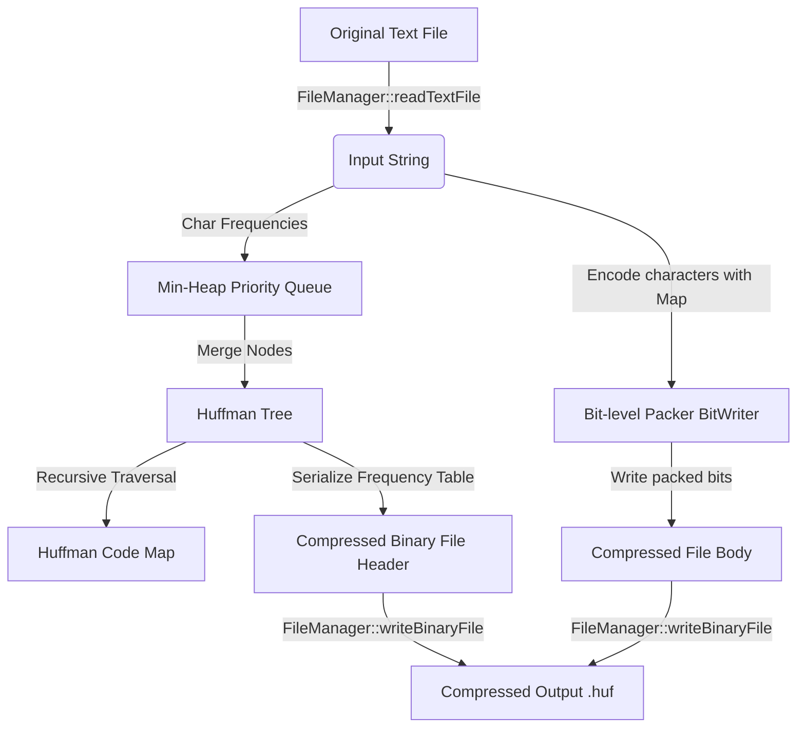

# Huffman File Compressor ⚡


A high-performance, lossless file compression and decompression utility built in C++17. This project utilizes the **Huffman Coding** algorithm to compress text files into compact binary files, achieving significant space savings.

Designed with **Object-Oriented Design (OOD)** principles, modular structure, robust error handling, and portable bit-level serialization, this repository serves as a showcase of core Data Structures and Algorithms (DSA) and modern C++ engineering.

---

## Table of Contents
1. [Core Features](#core-features)
2. [Console Preview](#console-preview)
3. [Project Architecture](#project-architecture)
4. [Algorithm Walkthrough: Step-by-Step Huffman Coding](#algorithm-walkthrough-step-by-step-huffman-coding)
5. [Code Quality & Systems Mechanics](#code-quality--systems-mechanics)
6. [Time & Space Complexity Analysis](#time--space-complexity-analysis)
7. [Binary File Format & Serialization](#binary-file-format--serialization)
8. [Build & Run Instructions](#build--run-instructions)


---

## Core Features

- **Lossless Compression & Decompression**: Compresses any input text file and fully restores it back to its original byte-matching state.
- **Portable Bit-level I/O**: Custom bit-level stream handlers (`BitWriter` and `BitReader`) to pack variable-length prefix codes efficiently into bytes.
- **Interactive CLI Menu**: Intuitive terminal dashboard to compress, decompress, inspect statistics, and visualize codes.
- **Tree Visualization**: Renders the generated Huffman Tree hierarchy directly in the terminal console.
- **Compression Statistics & Reports**: Displays original/compressed file sizes, compression ratio, space saved, and execution time. Automatically writes a formatted report file.
- **Comprehensive Error Handling**: Handles edge cases such as empty files, single-character inputs, missing files, and corrupted binary streams.

---

## Console Preview

When running `huffman.exe`, you are presented with a clean command-line interface:

```text
=======================================================
               HUFFMAN FILE COMPRESSOR                 
=======================================================

[1] Compress File
[2] Decompress File
[3] Show Compression Statistics (Last Session / Custom)
[4] Display Huffman Codes & Visual Tree
[5] Exit

Enter your choice (1-5): 
```

---

## Project Architecture

### Directory Structure
```text
Huffman-Compressor/
│
├── CMakeLists.txt           # Cross-platform CMake configuration
├── compile.bat              # Autodetecting Windows build script
├── main.cpp                 # Main entry point and interactive CLI menu loop
│
├── FileManager.h            # File I/O interface (text read/write, binary read/write)
├── FileManager.cpp          # File I/O implementation using std::filesystem
│
├── Huffman.h                # Node structs and HuffmanTree class definitions
├── Huffman.cpp              # Min-Heap construction, code gen, and tree print
│
├── Compressor.h             # Compression & Decompression interfaces & stats definitions
├── Compressor.cpp           # BitWriter, BitReader, serialization and pipeline implementation
│
├── input/                   # Default directory for testing input files
│   └── sample.txt           # Sample text file (automatically generated)
│
└── output/                  # Default directory for generated outputs
    ├── sample.huf           # Compressed binary file
    ├── sample_decomp.txt    # Reconstructed text file
    └── sample_report.txt    # Compression statistics report
```

### High-Level Data Flow


---

## Algorithm Walkthrough: Step-by-Step Huffman Coding

Let's illustrate Huffman Coding using a classic example string: `"ABRACADABRA!"` (12 characters).

### Step 1: Calculate Character Frequencies
First, compute the occurrences of each unique character in the string:
- `A` = 5, `B` = 2, `R` = 2, `C` = 1, `D` = 1, `!` = 1

### Step 2: Build a Priority Queue (Min-Heap)
Create a leaf node for each character and push it into a Min-Heap. The heap prioritizes nodes with the smallest frequencies.
```text
Heap state: [ (!:1), (C:1), (D:1), (B:2), (R:2), (A:5) ]
```

### Step 3: Repeatedly Merge Nodes to Build the Tree
Pop the two nodes with the lowest frequencies, merge them under a parent internal node with a frequency equal to their sum, and push the parent back into the heap. Repeat until only one root node remains.

```text
               * (12)
              /      \
        (0)  /        \  (1)
            A (5)      * (7)
                      /     \
                (0)  /       \ (1)
                    * (3)     * (4)
                   /   \     /   \
                  D     B   R     * (2)
                                 /   \
                                !     C
```

> [!NOTE]
> Since no code is a prefix of any other code, this is a **Prefix-Free Code**, ensuring unambiguous decompression without delimiters.

### Step 4: Generate Prefix Codes
Traverse the tree recursively from the root. Assign `0` when branching to the left child, and `1` when branching to the right child:
* `A` = `0`, `D` = `100`, `B` = `101`, `R` = `110`, `!` = `1110`, `C` = `1111`

### Step 5: Compress (Bit-Packing)
Translate `"ABRACADABRA!"` into its binary stream:
- `0101110011110100010111001110` (28 bits long).
- 28 bits fit into 4 bytes (32 bits) with 4 padding bits: `01011100 11110100 01011100 11100000`.
- Space saved: **66.6%**!

---

## Code Quality & Systems Mechanics

To make this a true resume-quality project, several advanced C++ programming standards are implemented:

1. **RAII & Manual Memory Management**: The tree uses raw pointers to clearly demonstrate tree structures. To prevent memory leaks, `HuffmanNode` features a recursive destructor that cascades down the tree:
   ```cpp
   ~HuffmanNode() {
       delete left;
       delete right;
   }
   ```
2. **Prevention of Double-Frees**: Copy constructor and copy assignment in `HuffmanTree` are explicitly marked `= delete` to prevent shallow copying of raw tree pointers. Move constructors are defined to safely transfer resources.
3. **Endian-Safe Serialization**: Integers written to binary files are serialized byte-by-byte using bitwise shifts (`<<`, `>>`) to guarantee files compressed on an Intel CPU (Little Endian) can be decompressed on an ARM CPU (Big Endian).

---


## Time & Space Complexity Analysis

Let:
- `N` = Number of characters in the input file.
- `V` = Number of unique characters (Vocabulary size, `V <= 256` for extended ASCII).

| Operation | Time Complexity | Space Complexity | Explanation |
| :--- | :--- | :--- | :--- |
| **Frequency Count** | O(N) | O(V) | Scans the file once; updates the hash map. |
| **Min-Heap Construction** | O(V log V) | O(V) | Pushes V leaf nodes into the priority queue. |
| **Tree Construction** | O(V log V) | O(V) | Pops and merges nodes V-1 times. Heap operations take O(log V). |
| **Code Generation** | O(V) | O(V) | Recursive tree traversal visits every node once. |
| **File Compression** | O(N) | O(N) | Reads character-by-character and writes codes using a lookup map. |
| **File Decompression** | O(N + V log V) | O(V) | Rebuilds tree from table in O(V log V); traverses tree for each bit in the stream. |

---

## Binary File Format & Serialization

To make the compressed file (.huf) self-contained, we store the frequency table in a binary header:

| Offset (Bytes) | Field Name | Data Type | Description |
| :--- | :--- | :--- | :--- |
| `0 - 3` | `unique_chars_count` | `uint32_t` | Total unique characters in the frequency table. |
| `4` | `character_1` | `char` (1 byte) | First character byte. |
| `5 - 8` | `frequency_1` | `uint32_t` (4 bytes) | Frequency of first character. |
| `...` | `character_i`, `frequency_i` | ... | Repeated entries for each unique character. |
| `Header End - 1` | `padding_bits_count` | `uint8_t` (1 byte) | Number of trailing dummy bits in the final byte (0-7). |
| `Header End onwards` | `compressed_bitstream` | `raw bytes` | The actual packed Huffman codes. |

---

## Build & Run Instructions

### Option A: Using the Windows Batch Script
If you are on Windows, simply double-click or execute the build helper script:
```powershell
.\compile.bat
```
*This will automatically search for **g++** or **cl.exe** in your PATH, statically link GCC dependencies, and output a standalone `huffman.exe`.*

### Option B: Manual Command Line Compiling
**Using GCC (Linux / macOS / Windows MinGW)**:
```bash
g++ -std=c++17 main.cpp FileManager.cpp Huffman.cpp Compressor.cpp -o huffman.exe -O2 -static
```

**Using MSVC (Visual Studio Developer Command Prompt)**:
```cmd
cl /EHsc /std:c++17 main.cpp FileManager.cpp Huffman.cpp Compressor.cpp /Fe:huffman.exe /O2
```

### Option C: Using CMake
If you prefer building inside an IDE or using CMake directly:
```bash
mkdir build
cd build
cmake ..
cmake --build .
```

