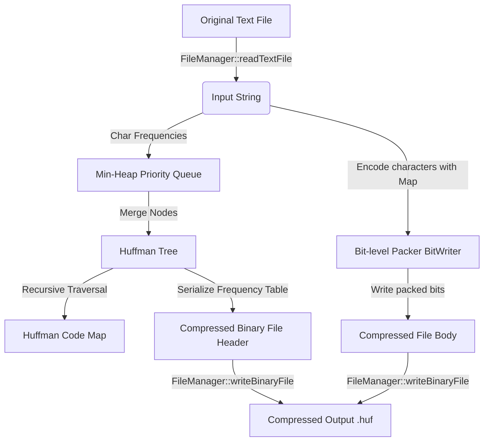

# Huffman File Compressor

A high-performance, lossless file compression and decompression utility built in C++17. This project utilizes the **Huffman Coding** algorithm to compress text files into compact binary files, achieving significant space savings.

Designed with **Object-Oriented Design (OOD)** principles, modular structure, robust error handling, and portable bit-level serialization, this repository serves as a showcase of core Data Structures and Algorithms (DSA) and modern C++ engineering.

---

## Table of Contents
1. [Core Features](#core-features)
2. [Project Architecture](#project-architecture)
3. [Algorithm Walkthrough: Step-by-Step Huffman Coding](#algorithm-walkthrough-step-by-step-huffman-coding)
4. [DSA Concepts Demonstrated](#dsa-concepts-demonstrated)
5. [Time & Space Complexity Analysis](#time--space-complexity-analysis)
6. [Binary File Format & Serialization](#binary-file-format--serialization)
7. [Build & Run Instructions](#build--run-instructions)
8. [Usage Guide](#usage-guide)
9. [Interview Preparation Guide (30 Q&As)](#interview-preparation-guide-30-qas)

---

## Core Features

- **Lossless Compression & Decompression**: Compresses any input text file and fully restores it back to its original byte-matching state.
- **Portable Bit-level I/O**: Custom bit-level stream handlers (`BitWriter` and `BitReader`) to pack variable-length prefix codes efficiently into bytes.
- **Interactive CLI Menu**: Intuitive terminal dashboard to compress, decompress, inspect statistics, and visualize codes.
- **Tree Visualization**: Renders the generated Huffman Tree hierarchy directly in the terminal console.
- **Compression Statistics & Reports**: Displays original/compressed file sizes, compression ratio, space saved, and execution time. Automatically writes a formatted report file.
- **Comprehensive Error Handling**: Handles edge cases such as empty files, single-character inputs, missing files, and corrupted binary streams.

---

## Project Architecture

### Directory Structure
```text
Huffman-Compressor/
│
├── CMakeLists.txt           # Cross-platform CMake configuration
├── compile.bat              # Autodetecting Windows build script
├── main.cpp                 # Main entry point and interactive CLI menu loop
│
├── FileManager.h            # File I/O interface (text read/write, binary read/write)
├── FileManager.cpp          # File I/O implementation using std::filesystem
│
├── Huffman.h                # Node structs and HuffmanTree class definitions
├── Huffman.cpp              # Min-Heap construction, code gen, and tree print
│
├── Compressor.h             # Compression & Decompression interfaces & stats definitions
├── Compressor.cpp           # BitWriter, BitReader, serialization and pipeline implementation
│
├── input/                   # Default directory for testing input files
│   └── sample.txt           # Sample text file (automatically generated)
│
└── output/                  # Default directory for generated outputs
    ├── sample.huf           # Compressed binary file
    ├── sample_decomp.txt    # Reconstructed text file
    └── sample_report.txt    # Compression statistics report
```

### Component Details
1. **`main.cpp`**: Controls the CLI application. Orchestrates user input, validates files, invokes the compressor/decompressor, triggers tree print outputs, and performs byte-by-byte integrity verification.
2. **`FileManager`**: A utility layer dealing exclusively with standard streams. Uses C++17 `<filesystem>` to handle file existence, path manipulations, and file size checks.
3. **`HuffmanTree`**: Represents the binary tree. It constructs the tree using a Min-Heap, generates the prefix-free codes recursively, and prints a visual horizontal layout of the tree.
4. **`Compressor`**: The core engine. Contains internal `BitWriter` and `BitReader` classes that handle bitwise packing. Orchestrates binary file serialization by writing the frequency table header followed by the packed bitstream.

### High-Level Data Flow


---

## Algorithm Walkthrough: Step-by-Step Huffman Coding

Let's illustrate Huffman Coding using a classic example string: `"ABRACADABRA!"` (12 characters).

### Step 1: Calculate Character Frequencies
First, compute the occurrences of each unique character in the string:
- `A` = 5
- `B` = 2
- `R` = 2
- `C` = 1
- `D` = 1
- `!` = 1

### Step 2: Build a Priority Queue (Min-Heap)
Create a leaf node for each character and push it into a Min-Heap. The heap prioritizes nodes with the smallest frequencies.
```text
Heap state: [ (!:1), (C:1), (D:1), (B:2), (R:2), (A:5) ]
```

### Step 3: Repeatedly Merge Nodes to Build the Tree
Pop the two nodes with the lowest frequencies, merge them under a parent internal node with a frequency equal to their sum, and push the parent back into the heap. Repeat until only one root node remains.

1. **Merge `!` (1) and `C` (1)**:
   - Create parent node `*` (frequency = 2), children: left = `!`, right = `C`.
   - Heap: `[ (D:1), (B:2), (R:2), (*_parent1:2), (A:5) ]`
2. **Merge `D` (1) and `B` (2)**:
   - Create parent node `*` (frequency = 3), children: left = `D`, right = `B`.
   - Heap: `[ (R:2), (*_parent1:2), (*_parent2:3), (A:5) ]`
3. **Merge `R` (2) and `*` (2)**:
   - Create parent node `*` (frequency = 4), children: left = `R`, right = `*` (`!` & `C`).
   - Heap: `[ (*_parent2:3), (*_parent3:4), (A:5) ]`
4. **Merge `*` (3) and `*` (4)**:
   - Create parent node `*` (frequency = 7), children: left = `*` (`D` & `B`), right = `*` (`R`, `!`, `C`).
   - Heap: `[ (A:5), (*_parent4:7) ]`
5. **Merge `A` (5) and `*` (7)**:
   - Create the final root node `*` (frequency = 12), children: left = `A`, right = `*` (7).
   - Heap size is now 1. The tree construction is complete!

### Step 4: Generate Prefix Codes
Traverse the tree recursively from the root. Assign `0` when branching to the left child, and `1` when branching to the right child. Leaf nodes store the accumulated path string as their Huffman code.

```text
               * (12)
              /      \
        (0)  /        \  (1)
            A (5)      * (7)
                      /     \
                (0)  /       \ (1)
                    * (3)     * (4)
                   /   \     /   \
                  D     B   R     * (2)
                                 /   \
                                !     C
```

Generated Encoding Table:
- `A` = `0`
- `D` = `100`
- `B` = `101`
- `R` = `110`
- `!` = `1110`
- `C` = `1111`

> [!NOTE]
> Since no code is a prefix of any other code, this is a **Prefix-Free Code**, ensuring unambiguous decompression without delimiters.

### Step 5: Compress (Bit-Packing)
Translate the text `"ABRACADABRA!"` into its binary stream:
- `A` (0) + `B` (101) + `R` (110) + `A` (0) + `C` (1111) + `A` (0) + `D` (100) + `A` (0) + `B` (101) + `R` (110) + `A` (0) + `!` (1110)
- Stream: `0101110011110100010111001110` (28 bits long)
- 28 bits fit into 4 bytes (32 bits) with 4 padding bits: `01011100 11110100 01011100 11100000`.
- Original file size was 12 bytes. Compressed bitstream size is 4 bytes. Space saved is **66.6%**!

### Step 6: Decompress (Bitstream Parsing)
Read the bitstream. Starting at the tree root, read bits one by one:
- Read `0`: go left. We reach leaf node `A`. Output `A`. Reset to root.
- Read `1` -> `0` -> `1`: right -> left -> right. We reach leaf node `B`. Output `B`. Reset to root.
- Repeat until all original characters are decoded.

---

## DSA Concepts Demonstrated

1. **Binary Trees**: Used as the foundational structure representing hierarchical prefix codes.
2. **Priority Queues (Min-Heap)**: Utilized to greedily extract the two nodes with minimum frequencies to build the tree bottom-up.
3. **Hash Maps (`std::unordered_map`)**:
   - Computes character frequencies in \(O(1)\) lookup time.
   - Maps characters to binary code strings for quick \(O(1)\) translation during compression.
4. **Recursion**: Used for tree traversal during code generation (`generateCodesHelper`), visual printing, and memory deallocation in node destructors.
5. **Bitwise Operations**: Leveraged in `BitWriter` and `BitReader` using bit-shifts (`<<`, `>>`) and bitwise OR/AND (`|`, `&`) to pack individual bits into 8-bit bytes.

---

## Time & Space Complexity Analysis

Let:
- \(N\) = Number of characters in the input file.
- \(V\) = Number of unique characters (Vocabulary size, \(V \le 256\) for extended ASCII).

| Operation | Time Complexity | Space Complexity | Explanation |
| :--- | :--- | :--- | :--- |
| **Frequency Count** | \(\mathcal{O}(N)\) | \(\mathcal{O}(V)\) | Scans the file once; updates the hash map. |
| **Min-Heap Construction** | \(\mathcal{O}(V \log V)\) | \(\mathcal{O}(V)\) | Pushes \(V\) leaf nodes into the priority queue. |
| **Tree Construction** | \(\mathcal{O}(V \log V)\) | \(\mathcal{O}(V)\) | Pops and merges nodes \(V-1\) times. Heap operations take \(\mathcal{O}(\log V)\). |
| **Code Generation** | \(\mathcal{O}(V)\) | \(\mathcal{O}(V)\) | Recursive tree traversal visits every node once. |
| **File Compression** | \(\mathcal{O}(N)\) | \(\mathcal{O}(N)\) | Reads character-by-character and writes codes using a lookup map. |
| **File Decompression** | \(\mathcal{O}(N + V \log V)\) | \(\mathcal{O}(V)\) | Rebuilds tree from table in \(\mathcal{O}(V \log V)\); traverses tree for each bit in the stream. |

---

## Binary File Format & Serialization

To make the compressed file (.huf) self-contained, we store the frequency table in a binary header:

| Offset (Bytes) | Field Name | Data Type | Description |
| :--- | :--- | :--- | :--- |
| `0 - 3` | `unique_chars_count` | `uint32_t` | Total unique characters in the frequency table. |
| `4` | `character_1` | `char` (1 byte) | First character byte. |
| `5 - 8` | `frequency_1` | `uint32_t` (4 bytes) | Frequency of first character. |
| `...` | `character_i`, `frequency_i` | ... | Repeated entries for each unique character. |
| `Header End - 1` | `padding_bits_count` | `uint8_t` (1 byte) | Number of trailing dummy bits in the final byte (0-7). |
| `Header End onwards` | `compressed_bitstream` | `raw bytes` | The actual packed Huffman codes. |

> [!TIP]
> Integers are serialized using byte-level shifts to ensure compatibility between Big-Endian and Little-Endian CPU architectures.

---

## Build & Run Instructions

Ensure you have a C++17 compatible compiler installed.

### Option A: Using the Windows Batch Script
If you are on Windows, simply double-click or execute the build helper script:
```powershell
.\compile.bat
```
It will automatically search for **GCC (g++)** or **MSVC (cl)** in your environment PATH, compile the files, and output `huffman.exe`.

### Option B: Manual Command Line Compiling
**Using GCC (Linux / macOS / Windows MinGW)**:
```bash
g++ -std=c++17 main.cpp FileManager.cpp Huffman.cpp Compressor.cpp -o huffman.exe -O2
```

**Using MSVC (Visual Studio Developer Command Prompt)**:
```cmd
cl /EHsc /std:c++17 main.cpp FileManager.cpp Huffman.cpp Compressor.cpp /Fe:huffman.exe /O2
```

### Option C: Using CMake
If you prefer building inside an IDE or using CMake directly:
```bash
mkdir build
cd build
cmake ..
cmake --build .
```

---

## Usage Guide

Run the generated executable:
```bash
.\huffman.exe
```

### Demonstration Flow:
1. **Compress**: Select Option `1`. Press Enter to use the default `input/sample.txt`. It generates `output/sample.huf` and a comprehensive `output/sample_report.txt` file.
2. **Decompress**: Select Option `2`. Press Enter to use the default `output/sample.huf`. It extracts the content to `output/sample_decomp.txt` and automatically performs a byte-match integrity check to prove lossless restoration.
3. **Check Statistics**: Select Option `3` to print the compression ratio, space saved, and time taken.
4. **Visualize Tree**: Select Option `4` to view the exact character mappings and print the ASCII hierarchical tree layout.

---

## Interview Preparation Guide (30 Q&As)

Here are 30 high-yield technical interview questions and detailed answers divided into core focus areas to help you master this project for interviews.

### Section 1: Huffman Coding & Information Theory

#### Q1: What is Huffman Coding and is it lossy or lossless?
**Answer**: Huffman Coding is an entropy encoding algorithm used for lossless data compression. It is lossless because it allows the exact original data to be reconstructed byte-for-byte without any degradation or information loss. It achieves compression by assigning variable-length codes to input characters based on their frequencies: more frequent characters get shorter codes, while less frequent characters get longer codes.

#### Q2: What is a prefix-free code, and why is it essential for Huffman coding?
**Answer**: A prefix-free (or prefix) code is a system where no valid code string is a prefix of any other code string (for example, if `A` is coded as `01`, no other character can have a code beginning with `01`, such as `011`). This is essential because it guarantees that a continuous bitstream can be decoded uniquely and unambiguously left-to-right without requiring delimiters between codes.

#### Q3: How does Huffman coding determine the optimal code length?
**Answer**: Huffman Coding approximates the optimal code lengths defined by Shannon’s Entropy theory. According to information theory, the optimal code length for a symbol of probability \(p\) is \(-\log_2(p)\) bits. By building a tree where path length corresponds to frequency, Huffman coding naturally generates code lengths that are close to this theoretical optimum.

#### Q4: When does Huffman coding perform poorly or fail to compress?
**Answer**: Huffman coding performs poorly when:
1. All characters have uniform frequencies (equal probability). In this case, variable-length codes offer no advantage, and the overhead of storing the tree/header can make the compressed file larger than the original.
2. The file is extremely small. The fixed overhead of the frequency table in the header can easily exceed the space saved by compression.

#### Q5: Can Huffman coding compress a file containing only one unique character? How does your project handle it?
**Answer**: Yes, but standard binary tree building requires at least two nodes to perform a merge. If a file has only one unique character (e.g. `"aaaa"`), the Min-heap size is 1. If unhandled, it wouldn't create branches, resulting in an empty code.
Our project handles this as an edge case in `HuffmanTree::buildFromFrequencies`: we pop the single leaf node and create a dummy parent node, assigning the character to its left child. This gives the character the binary code `"0"`, allowing it to be correctly packed and decoded.

#### Q6: Why do we write padding bits to the compressed file?
**Answer**: Computer files and memory buffers are byte-addressable, meaning they must be written in multiples of 8 bits. However, the compressed Huffman bitstream can end on any arbitrary bit count (e.g., 83 bits). To write this to a file, we must pad the final byte with dummy bits (e.g., 5 zeros) to make it 88 bits (11 full bytes). We store this `padding_bits_count` (5) in the header so the decompressor knows to ignore the last 5 bits of the stream.

#### Q7: How do you verify the integrity of the decompressed file?
**Answer**: In our `main.cpp` module, we perform an automated post-decompression check. We load both the original text file and the decompressed file, check if their sizes are equal, and perform a character-by-character comparison. If they match exactly, we output a success verification message. In production, this can also be done by calculating and comparing MD5 or SHA-256 hashes of the original and decompressed files.

#### Q8: What is Adaptive Huffman Coding, and how does it differ from Static Huffman Coding used here?
**Answer**: Static Huffman Coding requires scanning the file twice: once to calculate frequencies and build the tree, and once to encode the file. It also requires storing the tree header. Adaptive Huffman Coding builds the tree dynamically in a single pass. Both the compressor and decompressor update their trees symbol-by-symbol as they process the data, eliminating the need to transmit/store a frequency table header.

#### Q9: What is Shannon-Fano coding, and how does it compare to Huffman coding?
**Answer**: Shannon-Fano coding is another early compression algorithm. It works top-down by sorting symbols by frequency and recursively splitting them into two halves of approximately equal total frequency. Huffman coding works bottom-up, merging the lowest-frequency nodes first. Huffman coding is mathematically proven to always produce an optimal prefix code, whereas Shannon-Fano coding may sometimes produce sub-optimal codes.

#### Q10: How does Huffman Coding differ from LZW (Lempel-Ziv-Welch) compression?
**Answer**: Huffman Coding is an entropy coder that compresses single symbols based on their statistical frequency. LZW is a dictionary-based compressor (used in ZIP, GIF) that identifies repeating sequences of characters and replaces them with codes. LZW does not need a frequency table header and adapts to patterns in data, making it more effective for files with repeating words or phrases.

---

### Section 2: Data Structures & Algorithms (DSA)

#### Q11: Why is a priority queue (Min-Heap) used to build the Huffman tree instead of a sorted array?
**Answer**: Building the tree requires repeatedly finding and removing the two smallest frequency elements, and inserting a new merged node. 
- In a sorted array, inserting a new element takes \(\mathcal{O}(V)\) time due to shifting elements. Doing this \(V\) times results in \(\mathcal{O}(V^2)\) time complexity.
- In a Min-Heap (priority queue), extracting the minimums and inserting new elements takes \(\mathcal{O}(\log V)\) time. Doing this \(V\) times results in \(\mathcal{O}(V \log V)\) time complexity, which is significantly faster and more scalable.

#### Q12: What is the height of a Huffman Tree in the worst-case and best-case scenarios?
**Answer**:
- **Worst-case**: The tree is completely skewed (like a linked list) with a height of \(V - 1\). This happens when character frequencies follow the Fibonacci sequence (e.g., 1, 1, 2, 3, 5, 8...).
- **Best-case**: The tree is a complete, balanced binary tree with a height of \(\lceil \log_2(V) \rceil\). This happens when all characters have equal frequencies.

#### Q13: What is the relationship between the number of leaf nodes and internal nodes in a Huffman Tree?
**Answer**: A Huffman Tree is a strict binary tree (or full binary tree), meaning every node has either 0 or 2 children. In any full binary tree, if there are \(L\) leaf nodes (representing the unique characters), there will be exactly \(L - 1\) internal nodes. Therefore, the total number of nodes in a completed tree is \(2L - 1\).

#### Q14: Explain the role of the custom comparator `CompareNode` in the priority queue.
**Answer**: By default, `std::priority_queue` in C++ is a Max-Heap, prioritizing the largest element. We need a Min-Heap to greedily retrieve the nodes with the *lowest* frequencies. We define a comparator struct `CompareNode` overload `operator()` to return `lhs->frequency > rhs->frequency`. When `lhs->frequency` is greater than `rhs->frequency`, it returns true, causing the priority queue to position the lower frequency nodes at the top.

#### Q15: How does recursive traversal work during Huffman code generation?
**Answer**: We start at the root node with an empty code string `""`. We perform a preorder-like traversal:
- If we move left, we append `'0'` to the path.
- If we move right, we append `'1'` to the path.
- If we encounter a leaf node, we store the accumulated path string in our code lookup map under the character key.
- If the node is null, we return.

#### Q16: How do you prevent memory leaks when managing tree nodes dynamically in C++?
**Answer**: When nodes are created dynamically using `new`, they must be freed using `delete`. In our project, we write a recursive destructor directly inside the `HuffmanNode` struct:
```cpp
~HuffmanNode() {
    delete left;
    delete right;
}
```
In C++, calling `delete` on a null pointer is safe and does nothing. If `left` and `right` are not null, calling `delete` on them recursively triggers their destructors, deallocating the entire subtree safely. In `HuffmanTree`, we simply call `delete root;` to free the entire tree memory.

#### Q17: Why do we use `std::unordered_map` instead of `std::map` for frequencies and code tables?
**Answer**: 
- `std::unordered_map` is implemented as a Hash Table, providing \(\mathcal{O}(1)\) average time complexity for lookups and insertions.
- `std::map` is implemented as a Red-Black Tree (Balanced BST), providing \(\mathcal{O}(\log V)\) lookups and insertions.
Since we perform extensive lookups for characters during compression, the Hash Table provides optimal performance.

#### Q18: Can we reconstruct a Huffman Tree using only preorder and inorder traversal arrays?
**Answer**: While general binary trees can be reconstructed from preorder and inorder traversals, we do not need to store traversals for Huffman coding. By storing the frequency table (which maps characters to their exact occurrences) in the file header, the decompressor has all the information needed to re-run the priority queue merging process and reconstruct the exact same tree structure.

#### Q19: What is the maximum number of bits a Huffman code can have?
**Answer**: The maximum length of a code corresponds to the maximum depth of the tree. In the worst-case skewed tree (Fibonacci frequency distribution), the deepest leaf node will have a depth of \(V-1\). For ASCII where \(V \le 256\), the maximum code length is 255 bits.

#### Q20: How does your decompressor navigate the reconstructed tree to decode bits?
**Answer**: The decompressor initializes a pointer `currentNode` to the tree's root. For each bit read from `BitReader`:
- If the bit is `0`, `currentNode = currentNode->left`.
- If the bit is `1`, `currentNode = currentNode->right`.
- We check if `currentNode->isLeaf()`. If true, we output `currentNode->data`, reset `currentNode` back to the root, and repeat.

---

### Section 3: C++ Language Mechanics & C++17 Features

#### Q21: Why are the copy constructor and copy assignment operator deleted in the `HuffmanTree` class?
**Answer**: The `HuffmanTree` class manages raw memory pointers (`HuffmanNode* root`). If we copy a `HuffmanTree` object, the default compiler-generated copy constructor copies the raw pointer value (shallow copy). This results in two tree objects pointing to the same memory. When they go out of scope, both will attempt to call `delete root`, causing a **double-free runtime crash**. By writing:
```cpp
HuffmanTree(const HuffmanTree&) = delete;
HuffmanTree& operator=(const HuffmanTree&) = delete;
```
we prevent copies at compile-time, forcing the developer to use safe move operations or explicit clones.

#### Q22: What are move semantics, and how are they implemented in `HuffmanTree`?
**Answer**: Move semantics allow resources (like the dynamic tree memory) to be transferred from a temporary object to a new object without copying. We implement a move constructor and move assignment operator:
```cpp
HuffmanTree(HuffmanTree&& other) noexcept : root(other.root) {
    other.root = nullptr;
}
```
We copy the pointer to the new object and nullify `other.root` so that when the temporary object is destroyed, its destructor does not delete the tree memory we just moved.

#### Q23: Why do we open files with the `std::ios::binary` flag in `FileManager`?
**Answer**: On Windows, files opened in text mode automatically translate the newline character `\n` to carriage-return/line-feed `\r\n` during write operations, and convert `\r\n` back to `\n` on read. For binary files containing compressed bits, these automatic translations will corrupt the data. Using `std::ios::binary` disables all line-ending conversions, ensuring bytes are read and written exactly as they are.

#### Q24: What C++17 features does this project demonstrate?
**Answer**: 
1. **`<filesystem>` library**: Used to check file existence (`fs::exists`), check directory files (`fs::is_regular_file`), calculate file sizes (`fs::file_size`), and create directories (`fs::create_directories`).
2. **Nested Namespace Definition**: Clean syntax (e.g. `namespace A::B`).
3. **Structured Binding / Inline initializers**: (where applicable, e.g. loops like `for (auto const& [key, val] : map)`).

#### Q25: Why is `FileManager` designed with static methods and a deleted constructor?
**Answer**: `FileManager` is a stateless utility class. It doesn't hold any member variables or state. Therefore, creating an instance of it is unnecessary. Deleting the constructor (`FileManager() = delete;`) enforces compile-time restrictions against instantiation, promoting clean design.

#### Q26: Explain the portable integer serialization methods `writeUint32` and `readUint32`.
**Answer**: Different computer systems store integers in different byte orders (Little-Endian vs Big-Endian). Writing raw memory directly to disk using `file.write((char*)&val, 4)` is non-portable.
To solve this, we serialize integers byte-by-byte using bitwise shifts:
```cpp
dest.push_back(value & 0xFF);         // Extract byte 0
dest.push_back((value >> 8) & 0xFF);  // Extract byte 1
dest.push_back((value >> 16) & 0xFF); // Extract byte 2
dest.push_back((value >> 24) & 0xFF); // Extract byte 3
```
This guarantees that the integer is always written in Little-Endian format, regardless of the host machine's architecture.

#### Q27: How does `BitWriter` pack bits into a byte?
**Answer**: `BitWriter` uses a buffer byte `currentByte` and a counter `bitCount`. When we write a bit, we shift it to the correct position (from left to right):
`currentByte |= (1 << (7 - bitCount));`
We increment `bitCount`. Once `bitCount` reaches 8, the byte is full, so we push `currentByte` into our vector, reset `currentByte = 0`, and set `bitCount = 0`.

#### Q28: What is the risk of using raw pointers for binary trees in C++? How could smart pointers change the design?
**Answer**: The main risk of raw pointers is memory leaks if `delete` is not called, or double frees. Using `std::unique_ptr<HuffmanNode>` would eliminate the need for manual memory management and explicit destructors since smart pointers automatically free their owned resources when going out of scope. However, recursive destruction of very deep smart pointer trees can sometimes cause a stack overflow. In this project, raw pointers are used to clearly demonstrate dynamic memory ownership and recursive destructors.

#### Q29: How does using `const` references like `const std::string&` optimize performance?
**Answer**: In C++, passing objects like `std::string` or `std::vector` by value creates a full copy of the object, which is expensive in terms of time and memory. Passing by `const` reference passes a pointer-sized alias to the original object, avoiding copy overhead while ensuring that the function cannot modify the original data.

#### Q30: How does your code handle invalid compressed files during decompression?
**Answer**: We implement multiple defensive validation steps:
1. **Size check**: If the file size is less than the minimum header length (4 bytes), it aborts.
2. **Index bounds check**: Inside `readUint32` and header parsing, we verify if the read index exceeds the file byte size. If so, a `std::runtime_error` is thrown.
3. **Decoded counts match**: We compute the expected total characters from the frequency map. If the bitstream terminates before we decode the expected count, or traverses to a null tree path, we throw a corruption exception.
